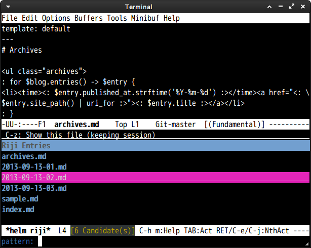

# riji.el

## Introduction

`riji.el` is utilities for using [Riji](https://github.com/Songmu/p5-Riji) blog system

## Screenshot

## Basic Usage

#### `riji-entry`

Create new entry

#### `riji-publish`

Publish all entries.

#### `helm-riji`

Show all entries in this Riji directory. [helm](https://github.com/emacs-helm/helm) is necessaly for this command.

## Related Project

* [riji.vim](https://github.com/boolfool/riji.vim)
